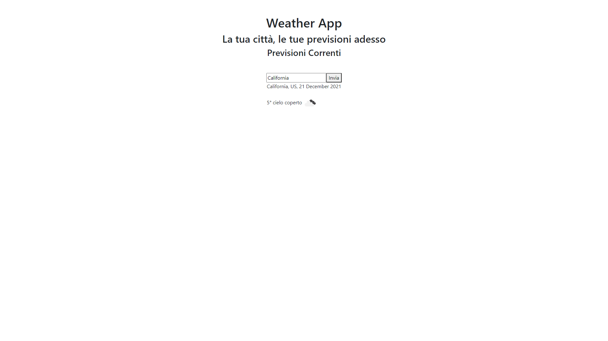

# AppEsercitazione

This project was generated with [Angular CLI](https://github.com/angular/angular-cli) version 12.2.9.

## About the app

Giving as input a city name, it will show you the weather.

It uses [Openweather](https://api.openweathermap.org) API and manages the response by using Observables, RxJS operators, etc.

